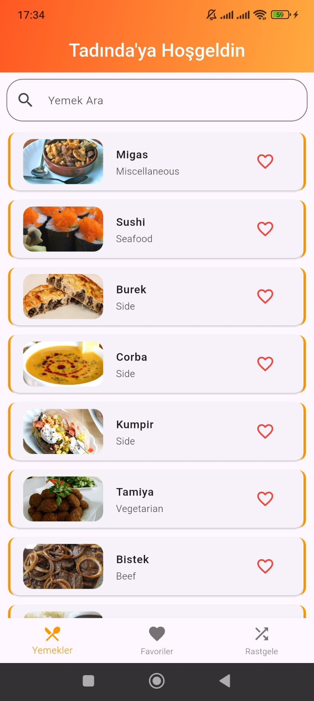
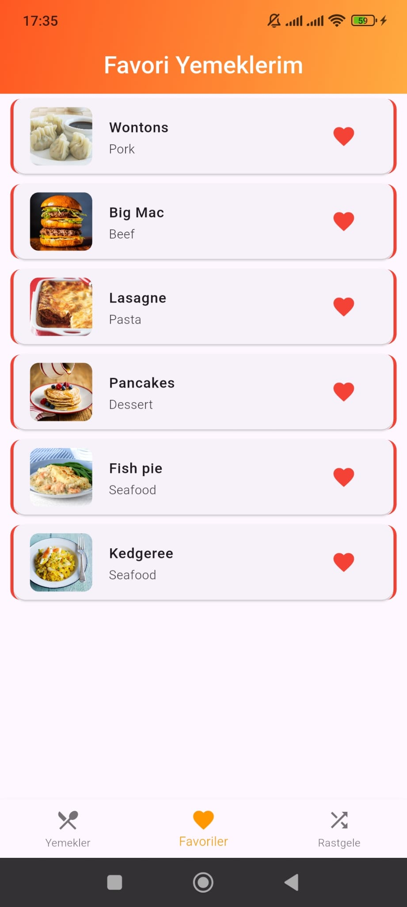
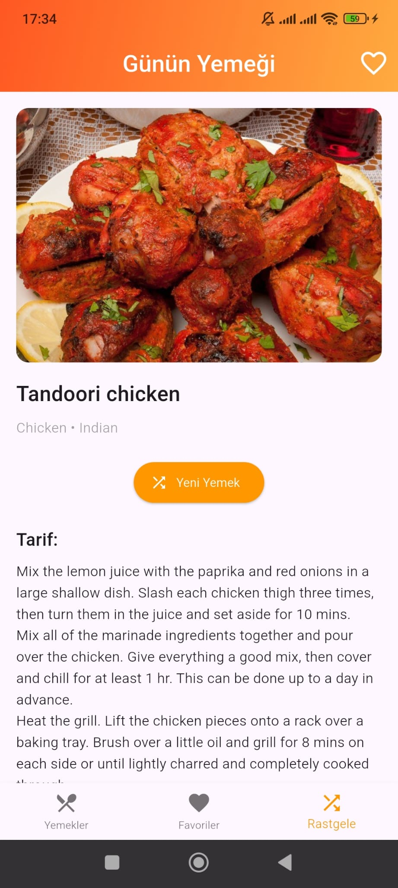

# Tadında
Yemek Tarifleri Uygulaması – Flutter + TheMealDB API

## İçindekiler

1. [Tanıtım](#tanıtım)
2. [Ekran Görüntüleri](#ekran-görüntüleri)
3. [Özellikler](#özellikler)
4. [Teknolojiler](#teknolojiler)

## Tanıtım

Bu uygulama **Flutter** ile geliştirilmiş olup, yemek tariflerini [TheMealDB](https://www.themealdb.com) API’sinden çekiyor.  
Kullanıcı, yemek araması yapabilir, tarif detaylarını görebilir; malzemeler ve ölçüleriyle eksiksiz bir görünüme sahip.

## Ekran Görüntüleri

| Ana Sayfa                          | Favoriler Ekranı                    | Rastgele Yemek Ekranı               |
|------------------------------------|-------------------------------------|-------------------------------------|
|  |  |  |

## Özellikler

- Gerçek zamanlı arama (yazdıkça sonuç gelir)
- Tarif detaylarını görüntüleme (tarif adımları, malzemeler)
- Modern ve şık kullanıcı arayüzü
- Resim desteği

## Teknolojiler

- **Flutter**
- **Dart**
- **TheMealDB API**
- **http** paketi  

